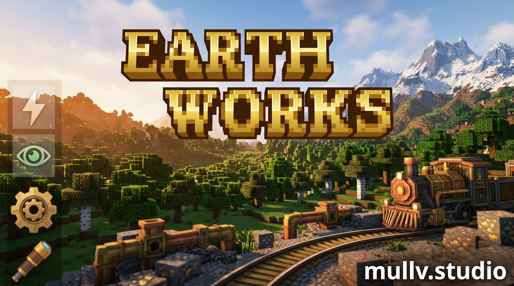

**MullV Earthworks** is a **vanilla‑plus engineering and exploration modpack** for **Minecraft 1.21.1 (NeoForge)**. It’s built around a custom 1:1‑style Earth‑inspired world, Create‑powered infrastructure, and performance‑tuned survival for long‑term worlds on the mullv.studio network.



You spawn in a **procedural 1:1 terrain world** used on the official MullV servers. You start small: simple shelter, and a rough base carved into the landscape. As you progress, you **industrialize entire regions with Create**, lay down **rail corridors between cities**, and build **persistent infrastructure** that feels grounded in the terrain instead of floating above it.

*This is a world for players who like big, permanent projects — rail networks, factories, ports, and cities that grow over months, not days.*

## Features

- 🗺️ **Custom 1:1‑style world** – Play on a carefully crafted large‑scale terrain designed for long‑term exploration, survival, and infrastructure projects, as used on the official MullV servers.
  Mods like **Antique Atlas**, **Ecologics**, **Repurposed Structures**, **Traveler’s Titles**, **Surveyor Map Framework**, **Surveystones**, and **Realistic Bees** deepen exploration and navigation so every journey feels like a real trip, not a quick teleport.

- ⚙️ **Create‑driven engineering sandbox** – Core **Create** plus a focused ecosystem of addons (e.g. **Big Cannons**, **Crafts & Additions**, **Diesel Generators**, **Create: New Age**, **Steam ’n’ Rails**, **Create: Nuclear**, **Railways Navigator**, **Train Physics**, **Threaded Trains**, **Train Utilities**, **Bells & Whistles**, **Structures Arise**, **Waystones Recipes**) let you design **factories, power grids, rail systems, and automation** that integrate naturally into the world.

- 🤝 **Survival and co‑op friendly** – Built with multiplayer in mind using **Simple Voice Chat**, **Hardcore Revival**, **Gravestone Mod**, **Waystones**, **Tom’s Simple Storage**, **Carry On**, **Double Doors**, **FallingTree**, **Easy Anvils**, **Steve’s Realistic Sleep**, and more for **smooth, cooperative survival** without heavy hand‑holding.

- 🧰 **Quality‑of‑life tools** – UI and utility mods such as **EMI**, **Jade** and addons, **AppleSkin**, **Better Advancements** + **Advancement Plaques/Screenshot**, **Highlighter**, **Item Borders**, **Legendary Tooltips**, **Visual Workbench**, **Pick Up Notifier**, **Searchables**, **Chat Heads**, **ChatAnimation**, **Just Zoom**, **Controlify**, and **BetterF3** keep information accessible while preserving a mostly‑vanilla feel.

- 🎧 **Polished visuals, audio, and UI** – **Iris** (shader support) plus **AmbientSounds**, **EnhancedVisuals**, **Immersive Thunder**, **Sound Physics Remastered**, **Blur+**, **ImmersiveUI**, **SpiffyHUD**, **Tiny Item Animations**, **WaveyCapes**, **Entity Texture/Model Features**, **NotEnoughAnimations**, **FirstPerson**, **oωo** and others create a **modern, cohesive presentation** without straying into ultra‑fantasy aesthetics.

- 🚀 **Performance‑first modpack** – **Sodium**, **Sodium Extra/Extras**, **Sodium Dynamic Lights**, **Lithium**, **Distant Horizons**, **ImmediatelyFast**, **ModernFix**, **FerriteCore**, **CreateBetterFps**, **Saturn**, **Dynamic FPS**, **ThreatenGL**, **EntityCulling**, **GPUTape** and supporting libraries are tuned to keep large bases, trains, and big views playable on a wide range of hardware.
  Support mods like **Crash Assistant**, **Modpack Update Checker**, **Global Packs**, **Load Support**, and **Euphoria Patcher** improve **stability and long‑term maintenance**.

***

## What kind of experience?

- Long‑term: Designed for **persistent worlds** (SMP or solo) where you slowly build out infrastructure over weeks or months.
- Grounded: Focuses on **engineering, logistics, and realistic terrain**, not magic progression or quest lines.
- Social: Out‑of‑the‑box support for **voice chat, co‑op survival, and shared projects** on the mullv.studio network or your own servers.

***

## Technical

```
Loader: NeoForge
Minecraft: 1.21.1
Purpose: Official mullv.studio modpack for custom 1:1 terrain servers
Recommended: 6–8 GB RAM allocated (more for heavy bases), SSD strongly recommended
Multiplayer: Built for use on official MullV servers, but works for self‑hosted worlds as well
```
